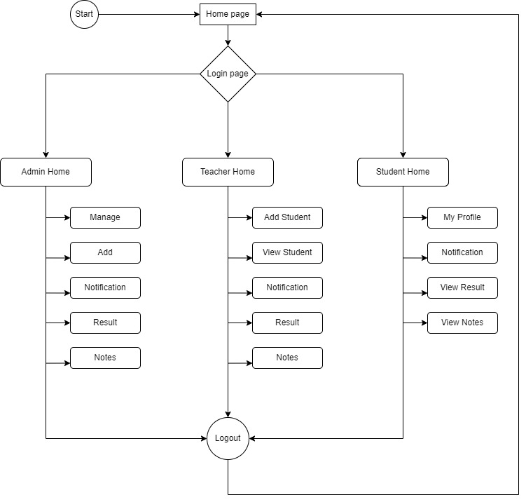

Made with ❤️ using Django

<h2 align="center">  🚀<a href="https://student-management-site.herokuapp.com/loginpage/" target='_blank'> Click here to try live demo.. </a></h2>

- login using following credentials
    - *Admin* ( admin@gmail.com - admin )
    - *Teacher* ( teacher@gmail.com - Teacher@100 )
    - *Student* ( student@gmail.com - Student@100 )

    <a href="https://github.com/ursmaheshj/Student_Management/issues/new/choose" target="blank">Report Bug</a>
    ·
    <a href="https://github.com/ursmaheshj/Student_Management/issues/new/choose" target="blank">Request feature</a>
    ·
    <a href="https://github.com/ursmaheshj/Student_Management/issues/new/choose" target="blank">Initiate Idea</a>

### Flow Diagram

## 🛠️ Installation Steps 

 > How to download and install :
- To start you should atleast have python and django installed.
- clone this repo using : git clone https://github.com/ursmaheshj/Student_Management.git or download zip/tar
- change database settings to establish connection to default django sqlite.
- run migrate and collectstatic commands
- after database creation create one superuser (defaultly assigned as Admin).
- now you can login and add teachers and students.

## 🧐 Features
- Userfriendly design
- Simple and Elegant UI
- Provided with Admin, Teacher and Student portfolios
- Default Authentication

### About the Platform

It consists of a simple home page with some information regarding the site's functionality and features.

- **Login Page**: The Login button takes you to the login page, where you must enter your email address and password as credentials.

- **Admin Dashboard**: Admin have the ability to manage both students and teachers, in addition to having full access to edit and administer all configuration settings.

- **Teacher Dashboard**: The teachers are able to keep track of the students grades, notes, and other information.

- **Student Dashboard**: Students can log in to their accounts in order to access their grades, notes, and notifications.

## 💻 Built with
- <a href="https://www.djangoproject.com/" target="blank">Django</a>
- <a href="https://adminlte.io/" target="blank">Adminlte</a>
- <a href="https://getbootstrap.com/" target="blank">Bootstrap</a>
- <a href="https://www.heroku.com/home" target="blank">Heroku</a>

## 🍰 Contributing

Please contribute using [GitHub Flow](https://guides.github.com/introduction/flow); Create a branch, add commits, and [open a pull request](https://github.com/ursmaheshj/Student_Management/compare).

## 🙏 Support
Dont hesitate to [fork](https://github.com/login?return_to=%2Fursmaheshj%2FStudent_Management) this repository and give a [star](https://github.com/login?return_to=%2Fursmaheshj%2FStudent_Management) if you like it..

